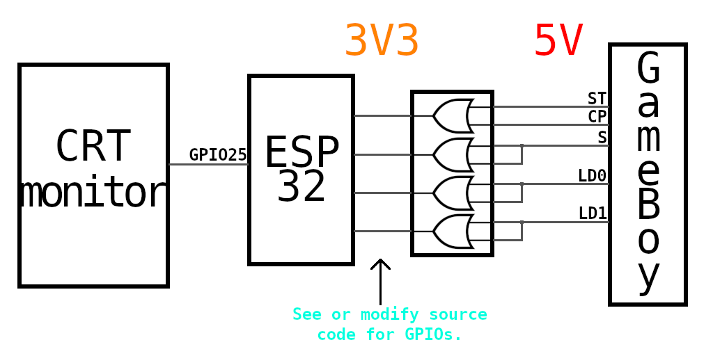

# ESP32 GameBoy video convertor

This is a simple program to capture GameBoy input and convert it to composite output using internal DAC.

## Output

Composite output is not really compliant with any standard. You can choose output waveform using `MODE_HACK` define.
This project is for driving CRT monitors that can accept out-of-spec signal by tweaking some trimmers.

## Input

ESP32 is not 5V compatible so you should use voltage level convertor.
Since you need at least one OR gate, you can try to find a part that can also handle voltage conversion.

## code

You need ESP32 SDK. I used version ESP-IDF 5.4, different versions might work.
Compile using `idf.py build` and flash using `idf.py flash`.

### More

See this in action: https://www.youtube.com/watch?v=TAXSR-eOCm8
